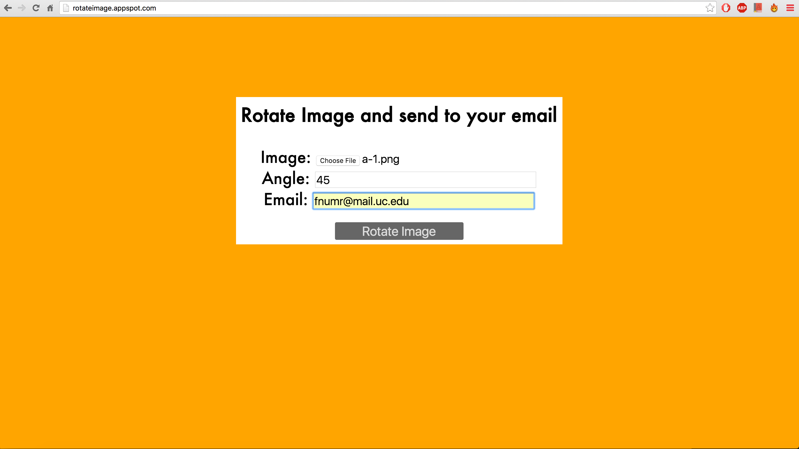
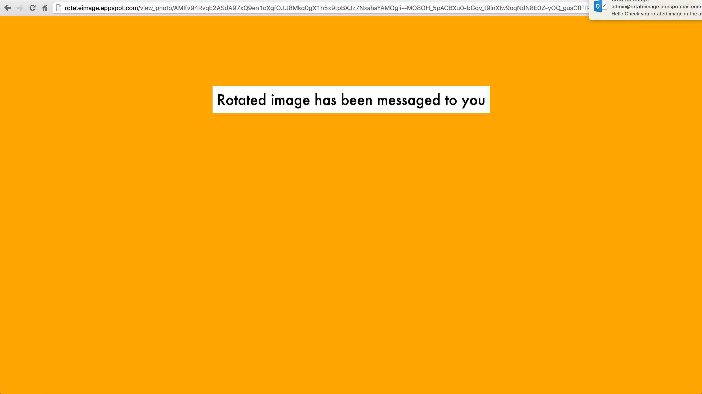
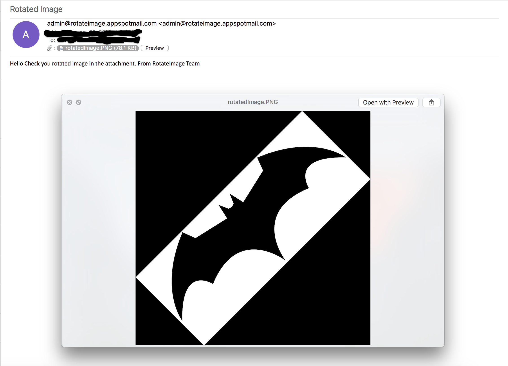

Rotate Image Web App
====================

~~URL: http://rotateimage.appspot.com/~~
------------------------------------

> Created a google app engine application 
> to rotate an image submitted by the user by POST method
> with additional parameters rotation angle in degrees and a
> valid email id, to send the rotated image.

# Used AppEngine web services
 - Image Transformation API (with PIL)
 - Google Cloud Datastore
   - NDB Datastore API
 - Mail API

# Version
1.0

# Example
An Sample image is rotated by 45 degrees and the output is e-mailed to the user.

 - Image:

 - Web app homepage

 - Web app output

 - Email message screenshot

